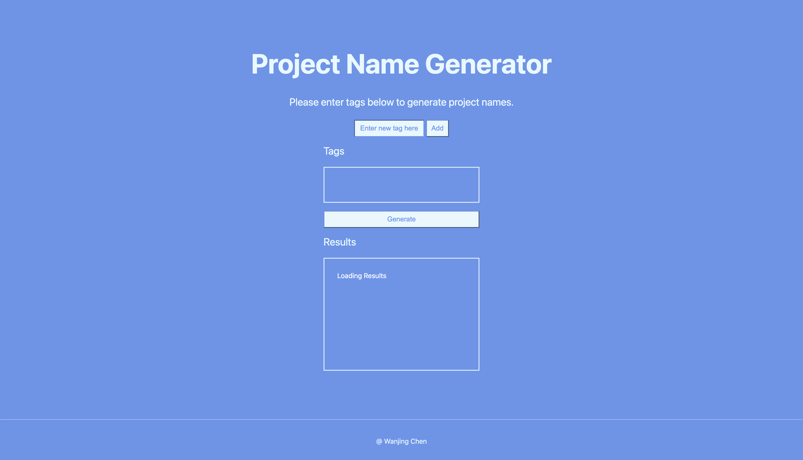
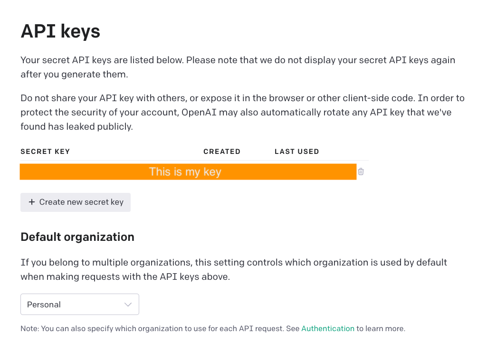

This project is about creating a single webpage that generates a bunch of project names based on given keywords input.

# How to run
To run the code, simply ```cd``` to the directory and run

```npm run dev```

And you can see the website at http://localhost:3000/. This is how it looks like:



There is a short demo video [here](https://youtu.be/1aQnDuiXf_4). 

To successfully call the Openai API in this project, you will need to create your own API keys. You can do it by 

1. Going to the Openai website and [sign up](https://auth0.openai.com/u/signup/identifier?state=hKFo2SBHYUx2YVJocjZ2aU9RRFVMVFExems5eTFVT2NnWU15TaFur3VuaXZlcnNhbC1sb2dpbqN0aWTZIHZGLXFUUmgtNzlnekZnQ25NTlluWGE3SEh0dnEtQmpBo2NpZNkgRFJpdnNubTJNdTQyVDNLT3BxZHR3QjNOWXZpSFl6d0Q). **Note**: You would be on free trial, and have about $18 free usage. After creating the account, you can see the API keys session in your account page:



2. Simply click *create new secret key* and you will have your key generated. Copy the key.

3. Create a file name it ```.env``` and put your key like this:

```OPENAI_API_KEY = "your API key here"```

4. **Very important!** Add ```.env``` in your ```.gitignore``` file. If you are cloning this project then it should already be in the ```.gitignore``` file, but double check.

To run the tests:

```npm run cypress```

It will open a window and if you click *E2E Testing* and after choosing a browser and click *Start E2E Testing in Chrome* you will be able to see the cypress files and run the tests.

# The project journey
## Project duration
4 working days

## Tech choices
- Framework: **Next.js** - I've never used React to build anything before, and Next.js seems to be a well-known React framework for building non-static websites. So I went for it to learn and practice React and building website.
- Testing: **Cypress** - This was listed at the top of the Next.js's commonly used testing tools and I have a little bit of experience with Cypress before, so again good chance to practice. 
- Name generating API: **OpenAI** [Product name generator](https://beta.openai.com/examples/default-product-name-gen) - GPT-3 is quite famous and that led me to OpenAI. They have an example usage of generating product name specifically and they have docs of how to make API reference.

**NOTE: My API key is only valid(free) for three months.**

## The challenge
I've never build anything with above tools before. A lot of learning on the way and a lot of trial and errors.

## Self reflection
This project has been a fun learning experience, I now feel more confident using React to build website and using Cypress for testing React. If I do this project again, I would have remembered to do TDD. This time, I only realised to write tests when I almost finish the project.

There are two main things that can be enhanced:

- User experience
- Tuning the settings of the Openai model. Right now some result names will be cut off in the middle as long as it reaches the token limit.
